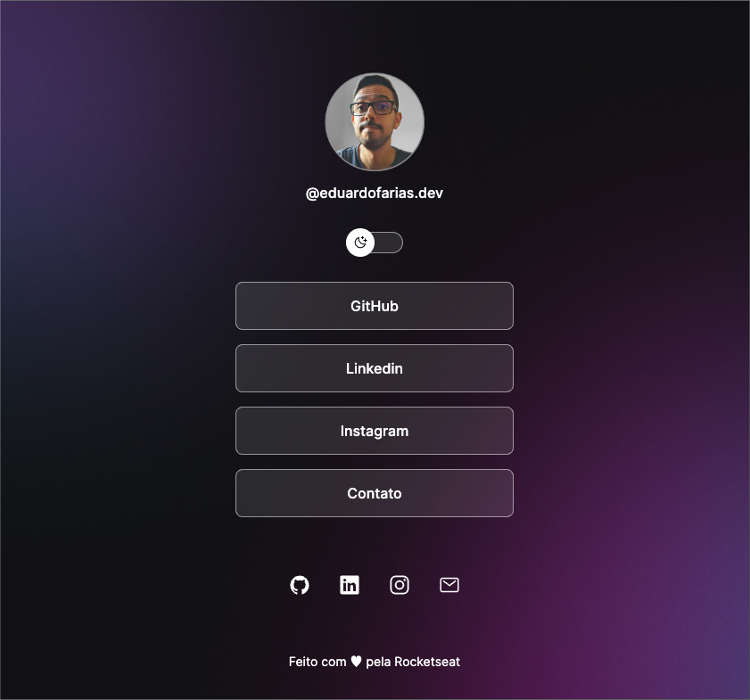

<h1 align="center"> DevLinks </h1>

Programa exclusivo e gratuito promovido pela Rocketseat para ensino de tecnologias WEB.

  <a href="#-tecnologias">Tecnologias</a>&nbsp;&nbsp;&nbsp;|&nbsp;&nbsp;&nbsp;
  <a href="#-projeto">Projeto</a>&nbsp;&nbsp;&nbsp;|&nbsp;&nbsp;&nbsp;
  <a href="#-layout">Layout</a>&nbsp;&nbsp;&nbsp;|&nbsp;&nbsp;&nbsp;
  <a href="#memo-licença">Licença</a>

  

 

  

 

## 🚀 &nbsp; Tecnologias

Esse projeto foi desenvolvido utilizando as seguintes tecnologias:

- HTML
- CSS
- JavaScript
- Git e Github
- Figma

 

## 💻 &nbsp; Projeto

o DevLinks é um agregador de links que pode ser utilizado como cartão de visitas online.

 

## 🔖 &nbsp; Layout

Você pode visualizar o layout do projeto através [desse link ](https://www.figma.com/community/file/1187422022288947321). É necessário ter conta no [Figma](https://figma.com) para acessá-lo.

 

## 📝 &nbsp; Licença :

Esse projeto está sob a licença MIT.
